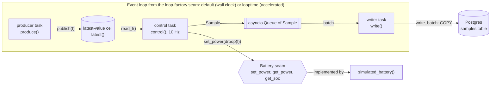

# Architecture

## Tasks

`run()` in `runtime.py` starts the three tasks in one `asyncio.TaskGroup`.

- **Producer.** It walks the frequency schedule. For each step it publishes the frequency into the latest-value cell and sleeps for the step's duration.
- **Control.** It ticks at 10 Hz on a fixed grid, for an exact number of ticks. Each tick reads the cell, commands `droop(f)`, reads back actual power and SoC, and puts a `Sample` on the queue. On exit it sets the battery to 0 W.
- **Writer.** It waits for a sample, takes everything else on the queue, and writes the batch. A `None` on the queue tells it to stop. If the TaskGroup cancels it, it still writes the samples it holds.

The latest-value cell keeps only the newest frequency, because control needs only the current value. The queue keeps every sample, because every sample must reach the store.

A failure in any task cancels the other two. This is the fail-stop rule.

## Seams

- **Battery.** A frozen dataclass of three async callables. `simulated_battery()` builds one from a pure core in `battery.py`. A network-connected BESS would build the same dataclass.
- **Loop factory.** The value passed to `asyncio.Runner(loop_factory=...)`. `None` gives the default loop on wall-clock time. `fast_loop` gives a looptime loop on accelerated time. The CLI `--fast` flag and the runtime and step tests use it. See [ADR 0002](adr/0002-event-loop-is-the-clock.md).
- **write_batch.** An async callable that takes a `list[Sample]`. `postgres_store()` in `store.py` writes each batch with one `COPY`. The unit tests pass an in-memory fake.

`droop()` in `droop.py` is a pure function. It knows nothing about time, the battery or the store.
